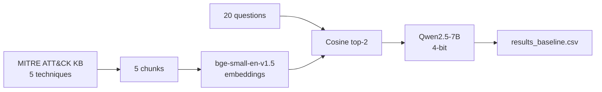
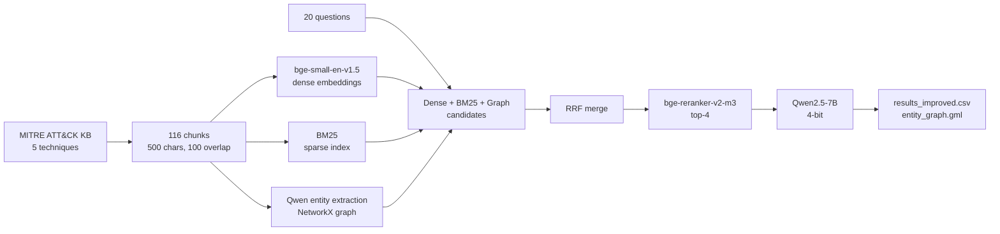

# Baseline RAG Flow

# Improved RAG Flow

# Findings

| Metric | Baseline | Improved | Delta |
|---|---|---|---|
| Overall mean hallucination score (0-3) | 1.15 | 0.5 | ↓ 57% |
| % answers with zero hallucination | 40% | 65% | ↑ 25 pts |
| Fairness std dev across categories | 0.378 | 0.134 | ↓ 65% |
| Worst category (Cloud) mean | 1.75 | 0.25 | ↓ 86% |
| Objective questions mean | 1.2 | 0.3 | ↓ 75% |
| Subjective questions mean | 1.1 | 0.7 | ↓ 36% |

