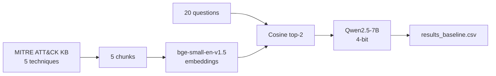
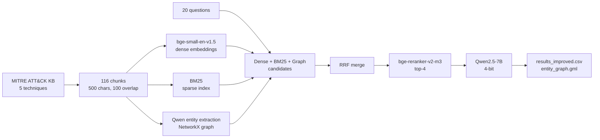

# Baseline RAG Flow

```mermaid
flowchart LR
    A["MITRE ATT&CK KB<br/>5 techniques"] --> B["5 chunks"]
    B --> C["bge-small-en-v1.5<br/>embeddings"]
    Q["20 questions"] --> D["Cosine top-2"]
    C --> D
    D --> E["Qwen2.5-7B<br/>4-bit"]
    E --> F["results_baseline.csv"]
```

# Improved RAG Flow

```mermaid
flowchart LR
    A["MITRE ATT&CK KB<br/>5 techniques"] --> B["116 chunks<br/>500 chars, 100 overlap"]
    B --> C["bge-small-en-v1.5<br/>dense embeddings"]
    B --> D["BM25<br/>sparse index"]
    B --> E["Qwen entity extraction<br/>NetworkX graph"]
    Q["20 questions"] --> F["Dense + BM25 + Graph<br/>candidates"]
    C --> F
    D --> F
    E --> F
    F --> G["RRF merge"]
    G --> H["bge-reranker-v2-m3<br/>top-4"]
    H --> I["Qwen2.5-7B<br/>4-bit"]
    I --> J["results_improved.csv<br/>entity_graph.gml"]
```
